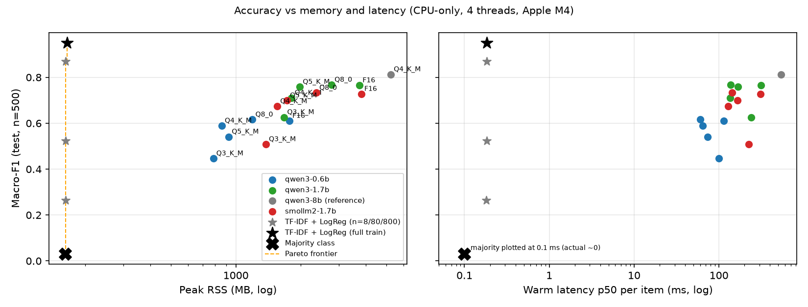
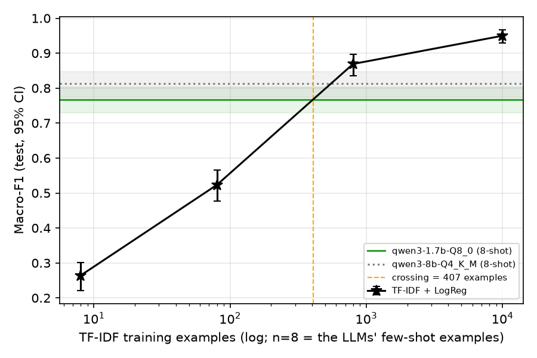

# Edge Triage Bench

*Independent project using public data.*

**Question:** how small and how compressed can a language model get before it stops being useful for a real triage task, and can it tell when it is unsure? I routed 500 bank customer-service messages ([BANKING77](https://huggingface.co/datasets/PolyAI/banking77), 8 triage labels) with three small open models (0.6B–1.7B), each quantised from F16 down to Q3_K_M on a laptop CPU. They are compared against a TF-IDF classifier and an 8B reference. **Answer:** the best small LLM (`qwen3-1.7b-Q8_0`, 8-shot) reaches macro-F1 0.768. That beats a TF-IDF model trained on the same 8 examples by a wide margin, but a TF-IDF model overtakes it after about **407 labelled examples**. With the full training set, TF-IDF scores 0.950 in 165 MB of RAM, beating every LLM tested, including the 8B.





## Results (test, n = 500, CPU-only)

| Config | Macro-F1 [95% CI] | Acc | Acc @50/70/90% cov | AURC | ECE | Invalid | File MB | Peak RSS MB | Warm p50 / p95 ms | Cold p50 / p95 ms |
|---|---|---|---|---|---|---|---|---|---|---|
| TF-IDF + LogReg (full train) | 0.950 [0.930, 0.967] | 0.948 | 1.000 / 0.994 / 0.984 | 0.005 | 0.048 | 0.0% | 0.9 | 165 | 0.2 / 0.2 | – / – |
| TF-IDF + LogReg (n=800) | 0.869 [0.835, 0.897] | 0.870 | 0.980 / 0.957 / 0.918 | 0.034 | 0.162 | 0.0% | 0.1 | 162 | 0.2 / 0.2 | – / – |
| qwen3-8b-Q4_K_M | 0.813 [0.774, 0.847] | 0.810 | 0.940 / 0.917 / 0.853 | 0.066 | 0.178 | 0.0% | 5,027.8 | 5,232 | 541.2 / 814.9 | 7,679.3 / 8,735.8 |
| qwen3-1.7b-Q8_0 | 0.768 [0.730, 0.803] | 0.766 | 0.908 / 0.871 / 0.804 | 0.100 | 0.215 | 0.0% | 2,165.0 | 2,779 | 136.8 / 189.7 | 1,275.3 / 1,360.9 |
| qwen3-1.7b-F16 | 0.765 [0.727, 0.799] | 0.762 | 0.904 / 0.866 / 0.800 | 0.102 | 0.224 | 0.0% | 4,069.7 | 3,747 | 312.7 / 478.8 | 1,131.8 / 1,194.7 |
| qwen3-1.7b-Q5_K_M | 0.758 [0.719, 0.791] | 0.756 | 0.900 / 0.880 / 0.791 | 0.099 | 0.233 | 0.0% | 1,471.8 | 1,979 | 168.1 / 262.9 | 2,125.9 / 2,495.4 |
| smollm2-1.7b-Q8_0 | 0.733 [0.693, 0.770] | 0.718 | 0.844 / 0.803 / 0.756 | 0.158 | 0.065 | 0.0% | 1,820.4 | 2,362 | 142.7 / 207.3 | 1,470.6 / 1,550.9 |
| smollm2-1.7b-F16 | 0.728 [0.688, 0.764] | 0.714 | 0.836 / 0.800 / 0.749 | 0.165 | 0.050 | 0.0% | 3,424.7 | 3,818 | 311.0 / 500.9 | 1,249.0 / 1,322.7 |
| qwen3-1.7b-Q4_K_M | 0.711 [0.672, 0.747] | 0.710 | 0.908 / 0.829 / 0.760 | 0.120 | 0.272 | 0.0% | 1,282.4 | 1,814 | 136.0 / 203.8 | 1,724.9 / 1,791.9 |
| smollm2-1.7b-Q5_K_M | 0.699 [0.659, 0.736] | 0.684 | 0.804 / 0.777 / 0.718 | 0.186 | 0.091 | 0.0% | 1,225.5 | 1,724 | 165.1 / 266.3 | 2,445.1 / 2,602.8 |
| smollm2-1.7b-Q4_K_M | 0.674 [0.631, 0.712] | 0.652 | 0.772 / 0.737 / 0.680 | 0.215 | 0.080 | 0.0% | 1,055.6 | 1,555 | 128.8 / 209.0 | 1,918.4 / 2,013.1 |
| qwen3-1.7b-Q3_K_M | 0.626 [0.580, 0.663] | 0.622 | 0.820 / 0.746 / 0.662 | 0.176 | 0.339 | 0.0% | 1,073.2 | 1,675 | 238.5 / 350.6 | 1,325.4 / 1,512.4 |
| qwen3-0.6b-Q8_0 | 0.616 [0.571, 0.655] | 0.598 | 0.756 / 0.689 / 0.622 | 0.222 | 0.271 | 0.0% | 804.8 | 1,193 | 60.6 / 88.8 | 491.9 / 512.8 |
| qwen3-0.6b-F16 | 0.610 [0.565, 0.650] | 0.594 | 0.768 / 0.689 / 0.616 | 0.218 | 0.276 | 0.0% | 1,509.3 | 1,770 | 114.1 / 185.1 | 492.3 / 520.2 |
| qwen3-0.6b-Q4_K_M | 0.589 [0.543, 0.631] | 0.578 | 0.752 / 0.671 / 0.618 | 0.249 | 0.289 | 0.0% | 484.2 | 860 | 64.8 / 99.5 | 665.0 / 713.4 |
| qwen3-0.6b-Q5_K_M | 0.541 [0.496, 0.581] | 0.534 | 0.744 / 0.640 / 0.571 | 0.246 | 0.300 | 0.0% | 551.4 | 926 | 73.4 / 112.8 | 800.6 / 841.7 |
| TF-IDF + LogReg (n=80) | 0.523 [0.477, 0.566] | 0.544 | 0.752 / 0.660 / 0.584 | 0.238 | 0.168 | 0.0% | 0.1 | 162 | 0.2 / 0.2 | – / – |
| smollm2-1.7b-Q3_K_M | 0.509 [0.468, 0.548] | 0.520 | 0.700 / 0.623 / 0.553 | 0.303 | 0.096 | 0.0% | 860.2 | 1,377 | 223.9 / 369.8 | 1,436.1 / 1,517.9 |
| qwen3-0.6b-Q3_K_M | 0.447 [0.399, 0.492] | 0.462 | 0.572 / 0.523 / 0.482 | 0.407 | 0.317 | 0.0% | 414.0 | 785 | 99.7 / 151.4 | 561.9 / 678.7 |
| TF-IDF + LogReg (n=8) | 0.264 [0.222, 0.300] | 0.266 | 0.276 / 0.294 / 0.284 | 0.701 | 0.062 | 0.0% | 0.0 | 162 | 0.2 / 0.2 | – / – |
| Majority class | 0.031 [0.025, 0.037] | 0.144 | 0.240 / 0.171 / 0.147 | 0.820 | 0.038 | 0.0% | 0.0 | 161 | 0.0 / 0.0 | – / – |

*Invalid* is the share of outputs that could not be parsed as a label (a grammar restricts the output to label words). *Acc @ X% cov* is the accuracy when the model answers only its X% most confident items. *Warm* latency reuses the fixed prompt prefix from the KV cache. *Cold* latency processes the full prompt (first 50 test items). The full table is in `results/summary.csv`, per-class F1 in `results/per_class_f1_test.csv`, and every figure in `results/figures/`.

**Does quantisation level matter?** Paired bootstrap of the macro-F1 change at each step (1,000 resamples on the same items):

| Model | Step | ΔMacro-F1 [95% CI] | p | Significant (CI excludes 0) |
|---|---|---|---|---|
| qwen3-0.6b | F16 → Q8_0 | +0.006 [-0.010, +0.023] | 0.446 | no |
| qwen3-0.6b | Q8_0 → Q5_K_M | -0.075 [-0.103, -0.047] | 0.000 | yes |
| qwen3-0.6b | Q5_K_M → Q4_K_M | +0.048 [+0.017, +0.077] | 0.000 | yes |
| qwen3-0.6b | Q4_K_M → Q3_K_M | -0.143 [-0.191, -0.097] | 0.000 | yes |
| qwen3-1.7b | F16 → Q8_0 | +0.003 [-0.011, +0.015] | 0.668 | no |
| qwen3-1.7b | Q8_0 → Q5_K_M | -0.009 [-0.024, +0.004] | 0.196 | no |
| qwen3-1.7b | Q5_K_M → Q4_K_M | -0.048 [-0.074, -0.023] | 0.000 | yes |
| qwen3-1.7b | Q4_K_M → Q3_K_M | -0.084 [-0.125, -0.044] | 0.000 | yes |
| smollm2-1.7b | F16 → Q8_0 | +0.005 [-0.003, +0.014] | 0.282 | no |
| smollm2-1.7b | Q8_0 → Q5_K_M | -0.033 [-0.058, -0.010] | 0.000 | yes |
| smollm2-1.7b | Q5_K_M → Q4_K_M | -0.025 [-0.055, +0.005] | 0.078 | no |
| smollm2-1.7b | Q4_K_M → Q3_K_M | -0.165 [-0.203, -0.121] | 0.000 | yes |

**TF-IDF learning curve vs `qwen3-1.7b-Q8_0`** (paired bootstrap):

| Train examples | Macro-F1 [95% CI] | Δ vs qwen3-1.7b-Q8_0 [95% CI] | p |
|---|---|---|---|
| 8 | 0.264 [0.222, 0.300] | -0.503 [-0.553, -0.453] | 0.000 |
| 80 | 0.523 [0.477, 0.566] | -0.244 [-0.296, -0.194] | 0.000 |
| 800 | 0.869 [0.835, 0.897] | +0.101 [+0.059, +0.145] | 0.000 |
| 9,997 | 0.950 [0.930, 0.967] | +0.182 [+0.145, +0.221] | 0.000 |

## Findings

- **How many labels does the LLM save you? About 407.** Trained on the 8 examples the LLMs see, TF-IDF scores 0.264; with 80 it scores 0.523, still -0.244 behind `qwen3-1.7b-Q8_0`. At 800 examples it is +0.101 ahead, and with the full training split it reaches 0.950, ahead of the 8B reference (0.813) as well. A small LLM is a cold-start tool for this task, not the end state.
- **Q8_0 is free; Q3_K_M breaks every model.** F16 → Q8_0 is never significant (Qwen3-1.7B +0.003, p = 0.67), and it halves memory. Q4_K_M → Q3_K_M is a significant drop for all three models (-0.084, -0.143, -0.165). Between those two points the effect depends on the model: Qwen3-1.7B loses -0.048 at Q5_K_M → Q4_K_M, and Qwen3-0.6B at Q5_K_M is significantly *worse* than at Q4_K_M. Each quantised file has to be tested; bit count alone is not a reliable guide.
- **The confidence signal is usable for abstention even though the probabilities are not calibrated.** `qwen3-1.7b-Q8_0` goes from 0.766 accuracy on everything to 0.871 on its 70% most confident items and 0.908 on the top 50%. But it is badly overconfident: 94% of items get confidence ≥ 0.9 (ECE 0.215). Use its confidence to rank items, not as a probability. SmolLM2 is better calibrated (ECE 0.065) but ranks worse (AURC 0.158 vs 0.100).
- **Latency depends mostly on the prompt cache, not the quantisation level.** For `qwen3-1.7b-Q8_0`, warm p50 is 137 ms and cold p50 (full prompt of about 420 tokens) is 1,275 ms. The 8B reference takes 7,679 ms cold. Q3_K_M is *slower* than Q4_K_M (Qwen3-1.7B warm p50 239 vs 136 ms): llama.cpp repacks Q4_K and Q8_0 weights for the ARM int8-matmul kernels but leaves q3_K on a generic path (see `DECISIONS.md`).
- **Per-class failures are concentrated.** `qwen3-1.7b-Q8_0` is weakest on `card_problem` (F1 0.652); its most common misroutes are to `account` (10) and `card_setup` (9) (item counts). Lost-phone and passcode messages read like account issues, and card-not-arrived versus card-not-working is a thin line.

## Reproduce

```bash
make all      # llama.cpp build, data, download + quantise models, test bench, report
make test     # pytest: metric maths vs scikit-learn, label parsing, split integrity
```

Requirements: `uv`, `cmake`, git, and about 60 GB of free disk space (mostly the Qwen3-8B F16 intermediate). On the recorded machine the warm test pass across all configurations took 26 min of inference. Model loads, warm-ups and the cold pass come on top of that, and so do download and quantisation time, which depend on the network.

- Machine: Apple M4, 10 cores, 16 GB RAM, Darwin 27.0.0.
- Runtime: llama.cpp `1ab7e5a` (Release, GGML_METAL=OFF, GGML_BLAS=ON (Apple), GGML_CPU_REPACK=ON), `llama-server -ngl 0 -t 4 -tb 4`.
- The protocol was frozen at commit **`8d3df10`**, before any test run.

## Method in brief

- **Data.** BANKING77, with 77 intents mapped to 8 triage labels. `dev` has 100 items and `test` 500, both stratified (seed 42) from the official test split. TF-IDF trains on the official train split, with no overlap (checked by a test). See [DATA.md](DATA.md).
  - CFPB complaint narratives were the first choice but are no longer published (see [DECISIONS.md](DECISIONS.md)).
- **Models.** Qwen3-0.6B, Qwen3-1.7B and SmolLM2-1.7B-Instruct at F16, Q8_0, Q5_K_M, Q4_K_M and Q3_K_M, plus Qwen3-8B at Q4_K_M. All were converted and quantised locally from pinned Hugging Face revisions. See [MODELS.md](MODELS.md).
- **Inference.** `llama-server` on CPU only at temperature 0. The prompt uses 8 few-shot examples, one per label, taken from dev. A GBNF grammar restricts output to the label words. Confidence comes from first-token log-probabilities renormalised over the labels.
- **Metrics.** Bootstrap CIs, paired bootstrap tests, risk–coverage and AURC, ECE, peak RSS, and warm and cold latency. See [PROTOCOL.md](PROTOCOL.md).
- **Discipline.** All prompt work was done on dev only. Test was run once per configuration. Every number here is written by `src/etb/report.py`.

## Limitations

- **One task, one dataset.** Short English messages from a single UK-style digital bank. It is not complaint narratives, and the brief's CFPB data could not be used. Longer inputs would change both the accuracy and the latency picture.
- **Small sample.** 500 test items give macro-F1 CIs of about ±0.04. Differences smaller than that are not claimed unless the paired test supports them.
- **CPU-only, one machine.** An Apple M4 with 4 performance-core threads. GPU/Metal and the Raspberry Pi 5 are not measured yet.
- **One prompt, no fine-tuning.** Prompt tuning on dev was light (three variants). Fine-tuning the small models would likely move the crossing point.
- **Warm latency assumes a fixed, cached prompt prefix.** Cold numbers use a 50-item subset.
- **The 8B reference is Q4_K_M only.**
